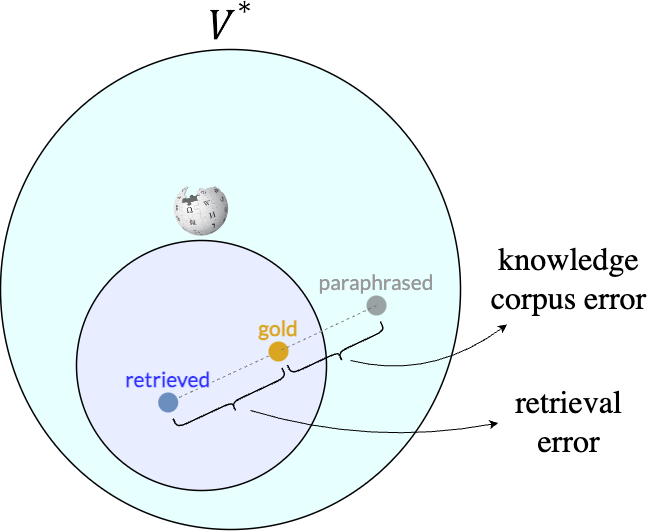

# Knowledge Corpus Error in Question Answering
This repo is an original implementation of the paper [Knowledge Corpus Error in Question Answering](https://arxiv.org/abs/2310.18076) (Findings of EMNLP 2023)
by [Yejoon Lee](https://github.com/yejoon-lee), [Philhoon Oh](https://philhoonoh.github.io/), and [James Thorne](https://jamesthorne.com/).

## Abstract


Recent works in open-domain question answering (QA) have explored **generating context passages from large language models (LLMs)**, replacing the traditional retrieval step in the QA pipeline. 
However, it is not well understood why generated passages can be more effective than retrieved ones. 

This study revisits the conventional formulation of QA and introduces the concept of *knowledge corpus error*. 
This error arises when **the knowledge corpus used for retrieval is only a subset of the entire string space**, potentially excluding more helpful passages that exist outside the corpus. 
LLMs may mitigate this shortcoming by generating passages in a larger space. 


We come up with an experiment of **paraphrasing human-annotated gold context using LLMs** to observe knowledge corpus error empirically. 
Our results across three QA benchmarks reveal an increased performance (10% - 13%) when using paraphrased passage, indicating a signal for the existence of knowledge corpus error.

## Environment
We use four additional python packages: `PyYAML`, `tenacity`, `openai==0.27.10`, and `anthropic==0.2.10`. You can install these in your Python environment.

Or simply install the requirements using the following command:
```shell
$ pip install -r requirements.txt
```

### Important note on OpenAI / Anthropic
Python SDKs for LLMs (`openai` and `anthropic`) are quickly evolving, so it is hard to guarantee that the code will work with the latest version of the SDKs. 
In fact, we have checked that our code breaks when using `anthropic==0.5.0`. Therefore, we recommend using the exact version we've provided above.

## Dataset
We use four QA benchmarks: NQ, HotPotQA, StrategyQA, and QASC.

- NQ:
- [HotPotQA](https://hotpotqa.github.io/): dev set (distractor) (`hotpot_dev_distractor_v1.json`)
- [StrategyQA](https://allenai.org/data/strategyqa): train split (`strategyqa_train.json`)
- [QASC](https://allenai.org/data/qasc): dev split (`dev.jsonl`)

Additionally, `strategyqa_train_paragraphs.json` from StrategyQA will be needed.

## Configuration
We keep the configurations in `config.yaml`. Change the following fields accordingly. We recommend using absolute paths.

- `dataset_path`: path to each of the dataset
- `strategyqa_paragraph_path`: path to "strategyqa_train_paragraphs.json" in StrategyQA
- `openai_key_path`: path to the file storing OpenAI API key
- `anthropic_key_path`: path to the file storing Anthropic API key

## Run
There are three steps in our pipeline: `paraphrase`, `read`, and `eval`. Each corresponds to a single script in the root directory.


### Paraphrase
Usage:
```shell
$ python paraphrase.py --help
usage: paraphrase.py [-h] --dataset DATASET [--buffer_size BUFFER_SIZE] [--data_path DATA_PATH] [--result_path RESULT_PATH]

Paraphrase human-annotated gold context using LLMs

options:
  -h, --help            show this help message and exit
  --dataset DATASET     nq, strategyqa, qasc, or hotpotqa
  --buffer_size BUFFER_SIZE
                        number of results to save at once. Default: 50
  --data_path DATA_PATH
                        path to the dataset file. If not given, use the path in config.yaml
  --result_path RESULT_PATH
                        path to save the results. If not given, automatically set

```
Example:
```shell
$ python paraphrase.py --dataset nq
```

### Read
Usage:
```shell
$ python read.py --help
usage: read.py [-h] --dataset DATASET --paraph_path PARAPH_PATH [--buffer_size BUFFER_SIZE] [--data_path DATA_PATH] [--result_path RESULT_PATH]

Generate answer to the question with given gold/paraphrased context

options:
  -h, --help            show this help message and exit
  --dataset DATASET     nq, strategyqa, qasc, or hotpotqa
  --paraph_path PARAPH_PATH
                        path to the paraphrased contexts which are the output of paraphrase.py
  --buffer_size BUFFER_SIZE
                        number of results to save at once. Default: 50
  --data_path DATA_PATH
                        path to the dataset file. If not given, use the path in config.yaml
  --result_path RESULT_PATH
                        path to save the results. If not given, automatically set

```
Example:
```shell
$ python read.py --dataset nq --paraph_path MY_PARAPHRASED_NQ.jsonl
```

### Eval
Usage:
```shell
$ python eval.py --help
usage: eval.py [-h] --dataset DATASET --result_path RESULT_PATH

Evaluate the results

options:
  -h, --help            show this help message and exit
  --dataset DATASET     nq, strategyqa, qasc, or hotpotqa
  --result_path RESULT_PATH
                        path to the results which are the output of read.py
```
Example:
```shell
$ python eval.py --dataset nq --read_path MY_READ_NQ.jsonl
```
